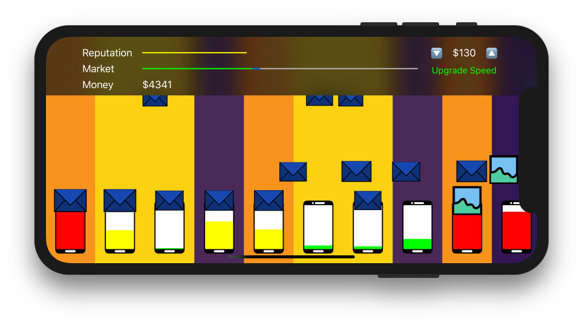

# Ludum Dare 42: Running out of Space

## Notes

**[Brainstorming Notes](Docs/Brainstorming.md)**

**[Concept Development/Mechanics](Docs/Mechanics.md)**

## Results/Game

SpaceIO is a game about running a cell phone startup, a startup where you manually manage the backup of user's data. Your job is to make sure that none of your customer's phones ever **run out of space**. Whenever they're awake, the customers will be sending emails and taking photos like crazy.

You have to choose how and when to back up their data. If their phones fill up, they'll take their business elsewhere. On top of managing the current customers, as a SpaceIO employee you have to set the price for new customes and oversee infrastructure upgrades.

## Screenshots and Videos

[YouTube Demo Video](https://youtu.be/-zD6PZJYJvg)

## Details

This game was build on Aug 10th and 11th, 2018.

It is licensed under the [MIT license](LICENSE.md).