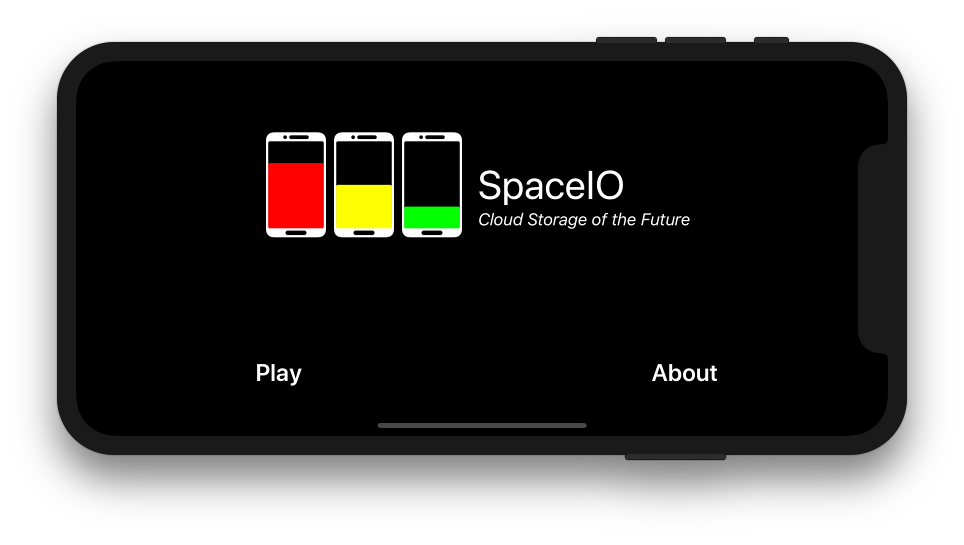
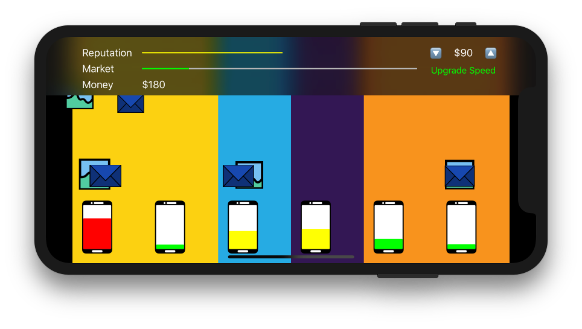
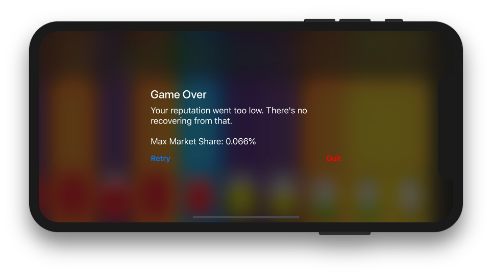

# Ludum Dare 42: Running out of Space

## Notes

**[Brainstorming Notes](Docs/Brainstorming.md)**

**[Concept Development/Mechanics](Docs/Mechanics.md)**

## Results/Game

SpaceIO is a game about running a cell phone startup, a startup where you manually manage the backup of user's data. Your job is to make sure that none of your customer's phones ever **run out of space**. Whenever they're awake, the customers will be sending emails and taking photos like crazy.

You have to choose how and when to back up their data. If their phones fill up, they'll take their business elsewhere. On top of managing the current customers, as a SpaceIO employee you have to set the price for new customers and oversee infrastructure upgrades.

## Screenshots and Videos

[YouTube Demo Video](https://youtu.be/Zgy6vgZ-EG4)

## Improvements

1. Convert all graphics from UIKit to CoreGraphic. I left them as UIView's because it's fast to pull in from PaintCode, but they are significantly less performant.
1. Fix the main loop. I'm using a timer and hoping that each game step is consistent. This was faster to prototype, but I'm not actually tracking delta's or setting my rates against anything real. All the rates are calibrated against the steps in isolation from time.
1. Balance mechanics, allow more control over types of infrastructure upgrades.
1. More dynamic icons (email can be colored, etc.)
1. More variety and care in generation of customers. Right now it's just a random rate for both email and picture taking.

## Changelog

* v1.0b2 - Updated phone graphic to avoid trademark issues
* v1.0b1 - Initial Ludum Dare 42 entry

## Details

This game was build on Aug 10th and 11th, 2018.

It is licensed under the [MIT license](LICENSE.md).
